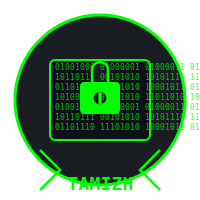

# Tamizh Hacker AI Coding Assistant

<div align="center">
  
  <h3>A powerful AI coding assistant with hacker aesthetics</h3>
  <p><i>Developed by S.Tamilselvan, SKP Engineering College, Tiruvannamalai, Tamil Nadu</i></p>
</div>

## 🔒 Overview

Tamizh is a sophisticated AI coding assistant built on top of Ollama's qwen2.5-coder:7b model, designed with a sleek hacker-themed interface. It provides intelligent code generation, code execution, and file management capabilities through an intuitive Streamlit interface.

## 🚀 Features

- **Intelligent Code Generation**: Leverages the qwen2.5-coder:7b model to generate high-quality code
- **Multi-language Support**: Works with Python, JavaScript, HTML, CSS, Bash, and more
- **Live Code Execution**: Run code snippets directly in the app
- **File Management**: Save, browse, and load generated code files
- **Speech Capabilities**: Text-to-speech functionality for AI responses
- **Hacker Aesthetics**: Green-on-black theme with custom animations
- **Custom System Prompt**: Configurable system prompt for specialized responses

## 🔌 Connection to LLM

Tamizh connects to the Ollama API to interact with the qwen2.5-coder:7b model. Here's how the connection works:

1. **Ollama Installation**: Requires [Ollama](https://ollama.ai/) to be installed and running locally
2. **Model Setup**: Uses the qwen2.5-coder:7b model which should be pulled using `ollama pull qwen2.5-coder:7b`
3. **API Connection**: Communicates with Ollama via its REST API at `http://localhost:11434`
4. **Configuration**: The API URL can be modified in the app's sidebar settings
5. **Request Format**:
   ```json
   {
     "model": "qwen2.5-coder:7b",
     "prompt": "User question here",
     "system": "System prompt here",
     "stream": false
   }
   ```
6. **Response Processing**: Parses the response and extracts code blocks for proper display and execution

## 📊 System Architecture

```
┌─────────────────┐     ┌──────────────┐     ┌─────────────────┐
│                 │     │              │     │                 │
│  Streamlit UI   │────▶│  Tamizh App  │────▶│  Ollama API     │
│  (User Input)   │     │  (Processing) │     │  (LLM Service)  │
│                 │     │              │     │                 │
└─────────────────┘     └──────────────┘     └─────────────────┘
                              │                       │
                              ▼                       ▼
                        ┌──────────────┐      ┌─────────────────┐
                        │              │      │                 │
                        │  Code        │      │  qwen2.5-coder  │
                        │  Execution   │      │  Model          │
                        │              │      │                 │
                        └──────────────┘      └─────────────────┘
                              │
                              ▼
                        ┌──────────────┐      
                        │              │      
                        │  File        │      
                        │  Management  │      
                        │              │      
                        └──────────────┘      
                              │
                              ▼
                        ┌──────────────┐      
                        │              │      
                        │  Text-to-    │      
                        │  Speech      │      
                        │              │      
                        └──────────────┘      
```

## 🔄 Application Flow

1. **User Input**: User enters a coding query in the chat interface
2. **Animation**: Hacker-themed loading animation is displayed
3. **API Request**: Query is sent to Ollama API with the configured system prompt
4. **Response Processing**: 
   - Response is parsed to extract text and code blocks
   - Code blocks are formatted by language
5. **Display**: Response is displayed with syntax highlighting for code
6. **Interaction Options**:
   - Run: Execute code directly in the app
   - Save: Store code in a file with automatic naming
   - Copy: Copy code to clipboard
   - Speak: Convert response to speech
7. **File Management**: Generated code can be saved, organized, and reloaded for editing

## 🛠️ Technical Stack

- **Frontend Framework**: Streamlit (Python)
- **AI Backend**: Ollama API with qwen2.5-coder:7b model
- **Code Execution**: Python subprocess module for secure execution
- **Speech Generation**: gTTS (Google Text-to-Speech)
- **Code Formatting**: Syntax highlighting with Streamlit's built-in code blocks
- **File System**: Python's os and io modules for file operations

## 🔧 Installation

1. Clone the repository
2. Install dependencies:
   ```bash
   pip install -r requirements.txt
   ```
3. Install and start Ollama:
   ```bash
   # Install Ollama from https://ollama.ai/
   # Pull the required model
   ollama pull qwen2.5-coder:7b
   # Start Ollama server
   ollama serve
   ```
4. Run the application:
   ```bash
   streamlit run app.py
   ```

## 📝 Configuration

The application can be configured through the sidebar:

- **Ollama API URL**: Change the endpoint for the Ollama API
- **Model Selection**: Choose which model to use (currently limited to qwen2.5-coder:7b)
- **System Prompt**: Customize the system instructions for the AI assistant

## 👨‍💻 Developer Information

**Developer**: S.Tamilselvan
**Profession**: Professional Hacker & Student
**Institution**: SKP Engineering College, Tiruvannamalai, Tamil Nadu
**Skills**: Ethical Hacking, Penetration Testing, Secure Coding, AI Development
**Created**: April 2025

## 📄 License

This project is licensed under the MIT License - see the LICENSE file for details.